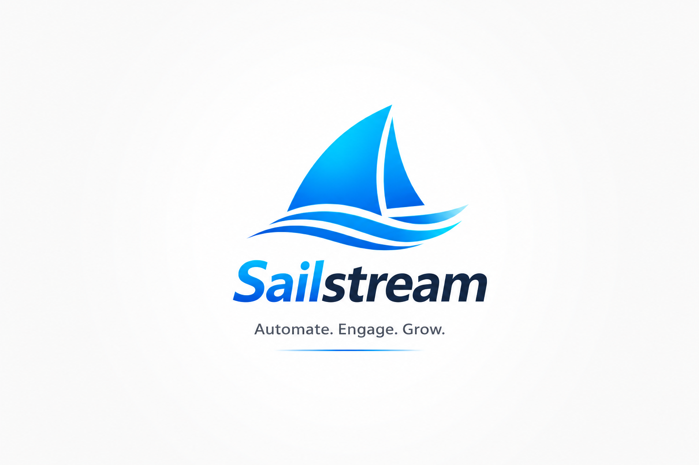

<div align="center">



# Sailstream

**A self-hosted, multi-platform social automation engine** — replies, takes orders, and posts products across WhatsApp, Facebook, Telegram, Twitter/X, and Viber.

[](https://golang.org/)
[](https://www.python.org/)
[](./LICENSE.md)
[]()

</div>

---

## 💡 The Point

I built this so devs don't have to deal with expensive, paperwork-heavy official APIs.

**Sailstream is a power tool for solo devs and freelancers.** It uses your own logged-in consumer accounts to automate storefronts. No monthly fees, no begging for access, no SaaS lock-in. Just you, a Go binary, and your credentials.

---

## ⚡ What It Does

- **Listens** to DMs and comments across 5+ platforms (real browser sessions + native protocols).
- **Understands** customers using a hand-written rules engine (English/Arabic/Kurdish) for orders, stock checks, and complaints—LLM is just a fallback.
- **Acts** by replying, quoting, blocking, or placing orders while respecting rate limits.
- **Posts** on a fixed schedule or randomly, optionally with AI captions.
- **Debugs** locally via a sandbox UI that simulates the entire pipeline without touching live accounts.

> ⚠️ **Heads up:** This automates *consumer* accounts, not official business APIs. That's a grey area. Read the Disclaimer before running it.

---

## 🧭 Startup Flow & Architecture

Here's how the app boots (`main.go` → Env → Maestro) and routes a message:

```mermaid
graph TD
    A[main.go] -->|Initializes files/paths| B(Environment Setup);
    B -->|Detects OS, Browser, Python| C[Maestro Orchestrator];
    
    C -->|Starts| D[Platform Listener];
    D -->|Incoming Message| E[NLU Processor];
    E -->|Intent/Entities| F[Tasker Compiler];
    F -->|Platform Instructions| D;
    D -->|Delivers reply| G[Platform API/Browser];
    
    C -->|Manages lifecycle| H[Session Manager];
    H -->|Unique session per platform+subtype| I[(SQLite DB)];
